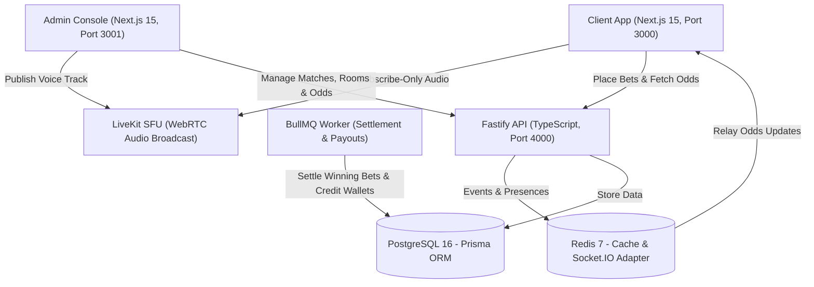

# StakeRoom — Sports Betting Platform with Live Match Rooms & Host Audio Broadcast

> A high-performance, real-time sports betting platform featuring live video stream synchronization and **one-way ultra-low latency host audio broadcasting** powered by LiveKit WebRTC SFU.

---

## 🏗 System Architecture



---

## 🎙 One-Way Host Audio Broadcast Design

- **Security Enforcement**: When clients join a room, the API generates a token using `@betting/audio-sdk` with:
  ```ts
  canPublish: false,
  canPublishData: false,
  canSubscribe: true
  ```
- **Host Privileges**: Only verified Admin room creators receive tokens with:
  ```ts
  canPublish: true,
  canPublishSources: [TrackSource.MICROPHONE]
  ```
- **Audience Isolation**: Room participants cannot hear or talk to each other, preventing noise interference and abuse during live matches.
- **Microphone UI & Waveform**:
  - The Admin Studio includes an audio level meter, device selector, and mute/unmute toggle.
  - The Client Room displays a live speech waveform animation that illuminates when the host speaks, with client-side volume adjustment.

---

## 📦 Monorepo Structure

```
├── apps/
│   ├── admin/             # Next.js 15 Host Studio & Management Console (:3001)
│   ├── api/               # Fastify 5 REST & WebSocket API (:4000)
│   ├── client/            # Next.js 15 Sportsbook & Match Room UI (:3000)
│   └── worker/            # BullMQ background settlement & payout processor
├── packages/
│   ├── audio-sdk/         # LiveKit token generator & room orchestrator
│   ├── config/            # Shared TypeScript & ESLint configurations
│   ├── db/                # Prisma schema, migrations, and database seed
│   ├── types/             # Zod validation schemas & shared TypeScript interfaces
│   └── ui/                # Shared Tailwind design primitives
├── docker-compose.yml     # PostgreSQL, Redis & LiveKit server stack
└── turbo.json             # Turborepo task pipeline
```

---

## 🚀 Quick Start Guide

### 1. Prerequisites
- **Node.js**: v20 or v22
- **pnpm**: v9 (`npm install -g pnpm`)
- **Docker & Docker Compose**

### 2. Clone and Setup Environment
```bash
# Copy root environment variables
cp .env.example .env

# Start infrastructure services (Postgres, Redis, LiveKit)
docker compose up -d
```

### 3. Install Workspace Dependencies
```bash
pnpm install
```

### 4. Setup Database & Seed Initial Matches
```bash
pnpm --filter @betting/db generate
pnpm --filter @betting/db migrate
pnpm --filter @betting/db seed
```

### 5. Launch All Applications in Parallel
```bash
pnpm dev
```

### 6. Access Platform Services
| Service | URL | Default Credentials |
| :--- | :--- | :--- |
| **Client Sportsbook** | [http://localhost:3000](http://localhost:3000) | `user@example.com` / `Password123!` |
| **Admin Console** | [http://localhost:3001](http://localhost:3001) | `admin@platform.com` / `AdminSecret123!` |
| **Fastify REST API** | [http://localhost:4000](http://localhost:4000) | — |
| **LiveKit SFU Server** | `ws://localhost:7880` | `devkey` / `secret` |

---

## ⚡ Key Features

- **Live Stream Synchronization**: Embeds YouTube Live, HLS (`.m3u8`), or custom RTMP feeds directly adjacent to real-time odds and audio.
- **Real-Time Odds Updates**: Odds adjustments pushed by admins immediately flash green/red across connected clients via Socket.IO and Redis Pub/Sub.
- **Atomic Bet Placement**: Strict database transactions with idempotency protection and wallet locking to eliminate double-spend risks.
- **BullMQ Settlement**: Instant background payout dispatch when matches finish and winning outcomes are selected.
